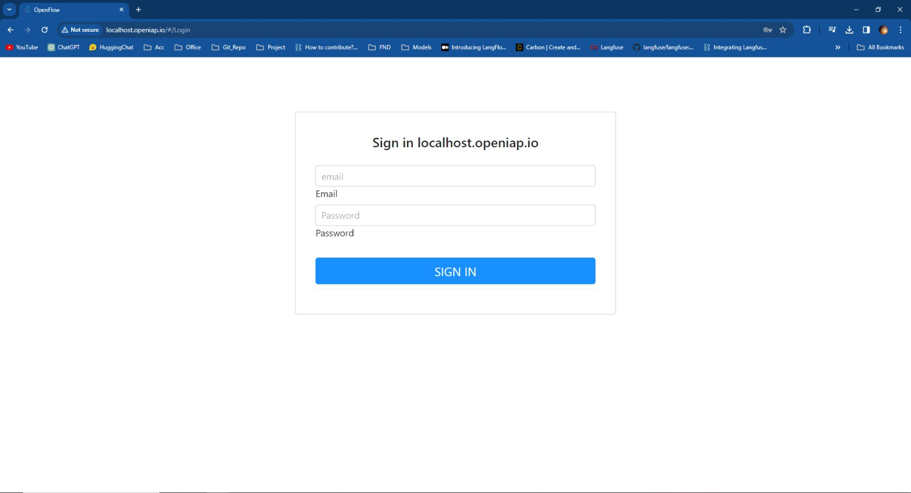
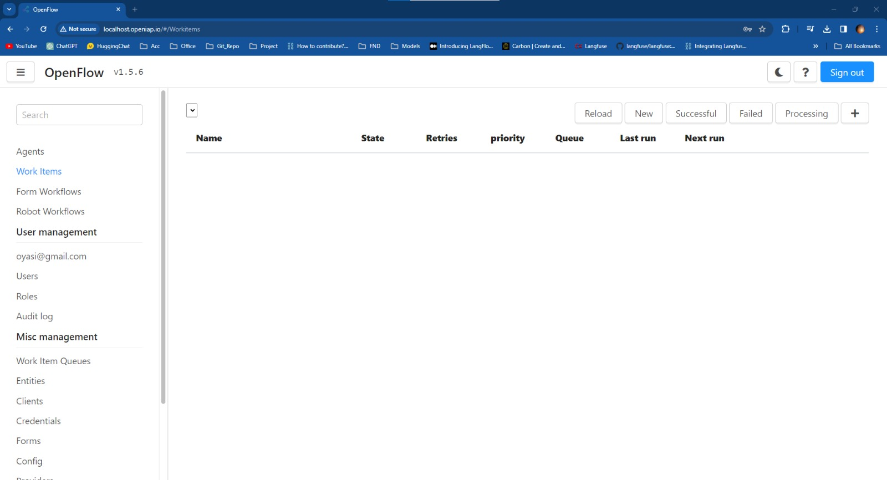
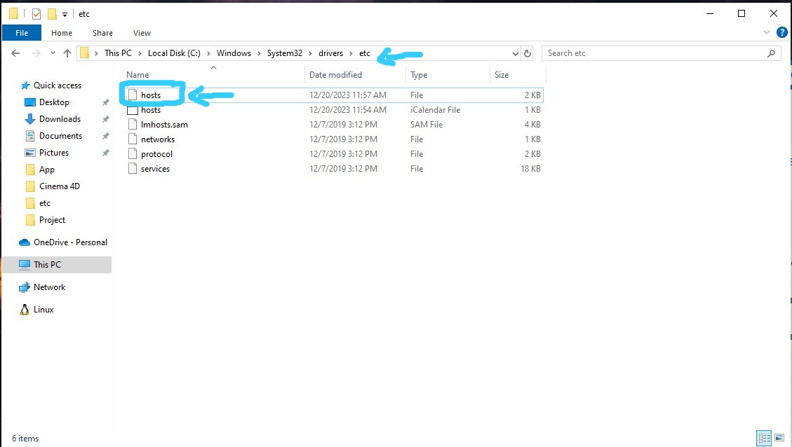
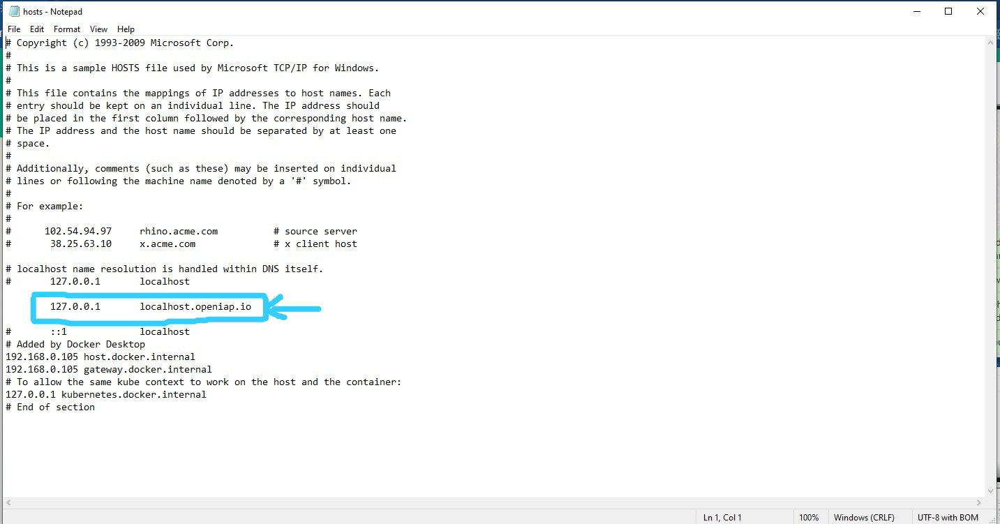

# Openflow-Docker (Offline)

# Getting Started




## Prerequisites

In order to start developing you need to satisfy the following prerequisites:

- Docker
- docker-compose
- user added to docker group

It is recommended you allocate at least 4GB of RAM to docker:

- [Instructions for Windows](https://docs.docker.com/docker-for-windows/#resources)
- [Instructions for macOS](https://docs.docker.com/docker-for-mac/#resources)


## DNS setup
### For Windows Platform
<b>Go to the Following directory</b>


<br>
<b>Now edit the hosts file using nodepad or any other editor(use administrator mode) and make following changes</b>


<b>Now save the file</b>


## Run in terminal / open in VSCode

Clone and change directory to frappe_docker directory

```shell
git clone git@github.com:oyasizaki/Openflow-old.git
cd Openflow-old
```
```shell
.\offline-pull.bat
```
```shell
.\offline-up.bat
```
## Open in web browser
```shell
http://localhost.openiap.io
```


